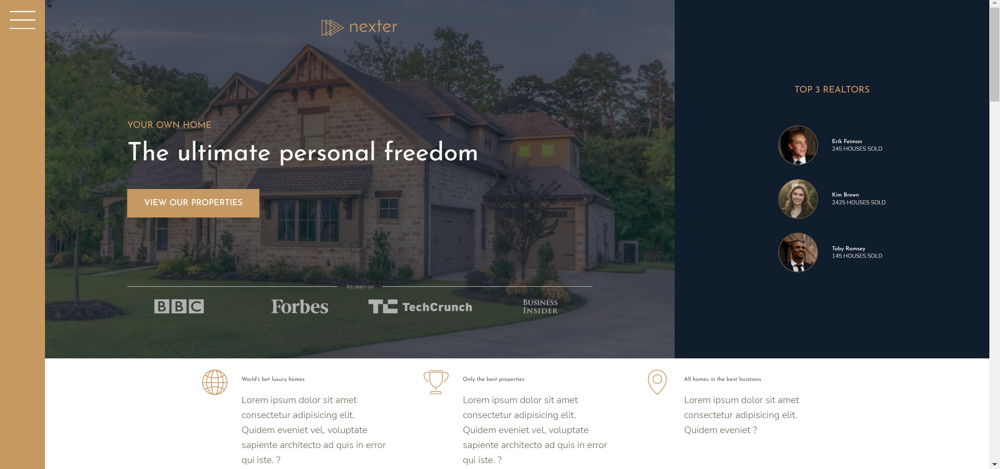
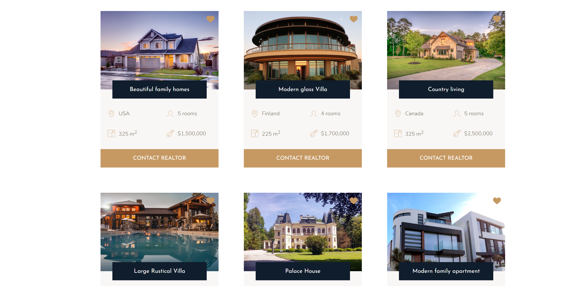

# Luxury homes

A sample project that was created with CSS Grid and sass technology. The project is responsive and adapts to various screen sizes.

## Aim

The aim was to reinforce CSS Grid patterns as well as learning and getting comfortable with sass. An image gallery was a great opportunity to practice creating content with grid as it can be confusing.

### What I learned

This was a nice project where I learned about creating one giant grid which can in turn help with the layout as the overall project develops. I also gained more confidence using sass for future projects.

### Problems

Naming the grid and setting values for rows and columns quickly became confusing and more practice is needed to continue using this style of css

### Built with

- HTML
- SASS

## Preview

## [Demo](https://luxury-homes-for-sale.netlify.app/)

### Author 

Simon Maher

### Acknowledgements

A big shout to Jonas for design inspiration and video content